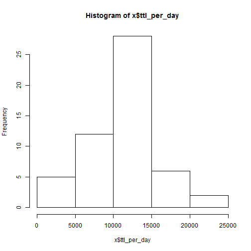
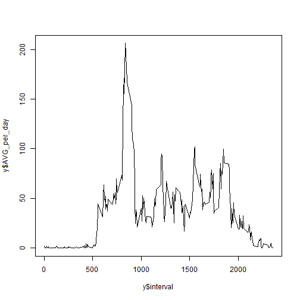
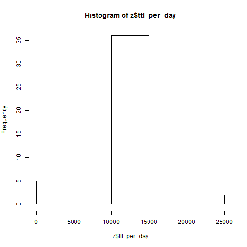
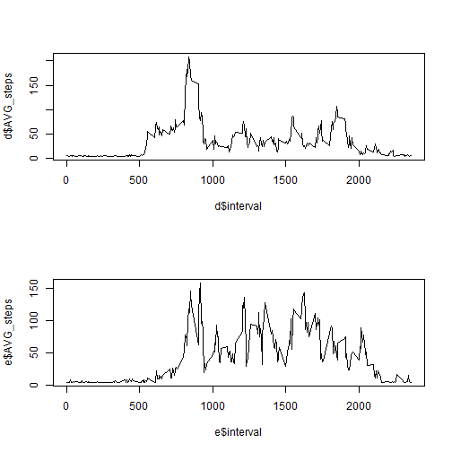

**Please Note: You will need the dplyr package to run my code. Thank you!**

Loading the Data, necessary packages & Convert Date column into Date:

```r
library(dplyr)
```

```
## 
## Attaching package: 'dplyr'
## 
## The following objects are masked from 'package:stats':
## 
##     filter, lag
## 
## The following objects are masked from 'package:base':
## 
##     intersect, setdiff, setequal, union
```

```r
dta <- read.csv("activity.csv")
dta$date <- as.character(dta$date)
dta$date <- as.Date(dta$date, "%m/%d/%Y")
dta <- tbl_df(dta)
```

**What is the total, mean and median number of steps taken per day?**


```r
x <- dta %>% group_by(date) %>% filter(!is.na(steps)) %>%summarize(ttl_per_day = sum(steps), Avg_per_day = mean(steps), median_per_day = median(steps))
x
```

```
## Source: local data frame [53 x 4]
## 
##          date ttl_per_day Avg_per_day median_per_day
## 1  2012-10-02         126     0.43750              0
## 2  2012-10-03       11352    39.41667              0
## 3  2012-10-04       12116    42.06944              0
## 4  2012-10-05       13294    46.15972              0
## 5  2012-10-06       15420    53.54167              0
## 6  2012-10-07       11015    38.24653              0
## 7  2012-10-09       12811    44.48264              0
## 8  2012-10-10        9900    34.37500              0
## 9  2012-10-11       10304    35.77778              0
## 10 2012-10-12       17382    60.35417              0
## ..        ...         ...         ...            ...
```

```r
hist(x$ttl_per_day)
```

 

**What is the average daily activity pattern?**


```r
y <- dta %>% group_by(interval) %>% filter(!(is.na(steps))) %>% summarize(AVG_per_day = mean(steps))
y
```

```
## Source: local data frame [288 x 2]
## 
##    interval AVG_per_day
## 1         0   1.7169811
## 2         5   0.3396226
## 3        10   0.1320755
## 4        15   0.1509434
## 5        20   0.0754717
## 6        25   2.0943396
## 7        30   0.5283019
## 8        35   0.8679245
## 9        40   0.0000000
## 10       45   1.4716981
## ..      ...         ...
```

```r
plot(x = y$interval, y = y$AVG_per_day, type = "l")
```

 

**Which 5-minute interval, on average across all the days in the dataset, contains the maximum number of steps?**


```r
y[which.max(y$AVG_per_day),]
```

```
## Source: local data frame [1 x 2]
## 
##   interval AVG_per_day
## 1      835    206.1698
```

**Imputing Missing Values**

Calculate and report the total number of missing values in the dataset (i.e. the total number of rows with NAs)


```r
nrow(filter(dta, is.na(steps)))
```

```
## [1] 2304
```


Devise a strategy for filling in all of the missing values in the dataset. The strategy does not need to be sophisticated. For example, you could use the mean/median for that day, or the mean for that 5-minute interval, etc. Create a new dataset that is equal to the original dataset but with the missing data filled in.


```r
dta[is.na(dta)] <- mean(dta$steps, na.rm= TRUE)
dta
```

```
## Source: local data frame [17,568 x 3]
## 
##      steps       date interval
## 1  37.3826 2012-10-01        0
## 2  37.3826 2012-10-01        5
## 3  37.3826 2012-10-01       10
## 4  37.3826 2012-10-01       15
## 5  37.3826 2012-10-01       20
## 6  37.3826 2012-10-01       25
## 7  37.3826 2012-10-01       30
## 8  37.3826 2012-10-01       35
## 9  37.3826 2012-10-01       40
## 10 37.3826 2012-10-01       45
## ..     ...        ...      ...
```

Make a histogram of the total number of steps taken each day and Calculate and report the mean and median total number of steps taken per day. Do these values differ from the estimates from the first part of the assignment? What is the impact of imputing missing data on the estimates of the total daily number of steps?


```r
z <- dta %>% group_by(date) %>% filter(!is.na(steps)) %>%summarize(ttl_per_day = sum(steps), Avg_per_day = mean(steps), median_per_day = median(steps))
z
```

```
## Source: local data frame [61 x 4]
## 
##          date ttl_per_day Avg_per_day median_per_day
## 1  2012-10-01    10766.19    37.38260        37.3826
## 2  2012-10-02      126.00     0.43750         0.0000
## 3  2012-10-03    11352.00    39.41667         0.0000
## 4  2012-10-04    12116.00    42.06944         0.0000
## 5  2012-10-05    13294.00    46.15972         0.0000
## 6  2012-10-06    15420.00    53.54167         0.0000
## 7  2012-10-07    11015.00    38.24653         0.0000
## 8  2012-10-08    10766.19    37.38260        37.3826
## 9  2012-10-09    12811.00    44.48264         0.0000
## 10 2012-10-10     9900.00    34.37500         0.0000
## ..        ...         ...         ...            ...
```

```r
hist(z$ttl_per_day)
```

 

Impact of imputation is that the total, mean and median all shift towards the right on the number line. Although, the impact is minimal, since there were only about 2000 missing values.

**Are there differences in activity patterns between weekdays and weekends?**

Create a new factor variable in the dataset with two levels - "weekday" and "weekend" indicating whether a given date is a weekday or weekend day.


```r
a <- cbind(dta,weekdays(as.Date(dta$date, '%Y-%m-%d')))
a <- tbl_df(a)
colnames(a) <- c("steps","date","interval","weekday")

b <- as.factor(a$weekday)
levels(b) <- list(
    Weekday = c("Monday", "Tuesday","Wednesday","Thursday","Friday"),
    Weekend = c("Saturday", "Sunday")
)

a <- cbind(a,b)
a <- tbl_df(a)

colnames(a) <- c("steps","date","interval","weekday","flag")

a
```

```
## Source: local data frame [17,568 x 5]
## 
##      steps       date interval weekday    flag
## 1  37.3826 2012-10-01        0  Monday Weekday
## 2  37.3826 2012-10-01        5  Monday Weekday
## 3  37.3826 2012-10-01       10  Monday Weekday
## 4  37.3826 2012-10-01       15  Monday Weekday
## 5  37.3826 2012-10-01       20  Monday Weekday
## 6  37.3826 2012-10-01       25  Monday Weekday
## 7  37.3826 2012-10-01       30  Monday Weekday
## 8  37.3826 2012-10-01       35  Monday Weekday
## 9  37.3826 2012-10-01       40  Monday Weekday
## 10 37.3826 2012-10-01       45  Monday Weekday
## ..     ...        ...      ...     ...     ...
```

Make a panel plot containing a time series plot (i.e. type = "l") of the 5-minute interval (x-axis) and the average number of steps taken, averaged across all weekday days or weekend days (y-axis). 


```r
wd <- tbl_df(filter(a, flag == "Weekday"))
we <- tbl_df(filter(a, flag == "Weekend"))

d <- wd %>% group_by(interval) %>% summarize(AVG_steps = mean(steps))

e <- we %>% group_by(interval) %>% summarize(AVG_steps = mean(steps))

par(mfrow=c(2,1))

plot(x = d$interval, y = d$AVG_steps, type = "l")
plot(x = e$interval, y = e$AVG_steps, type = "l")
```

 
